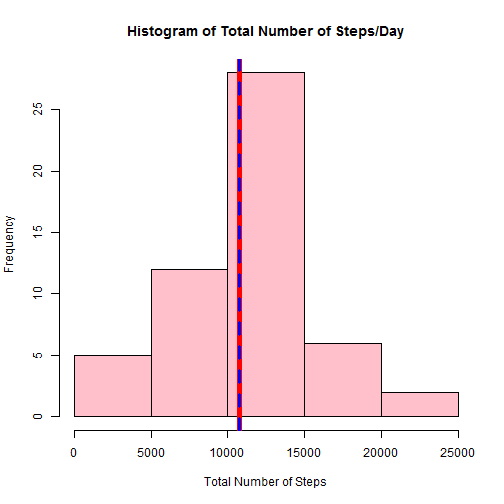
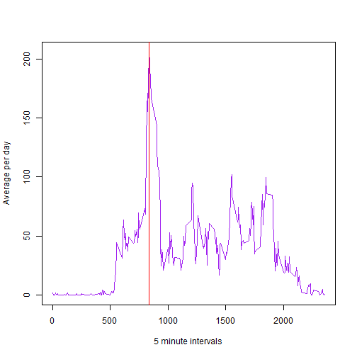
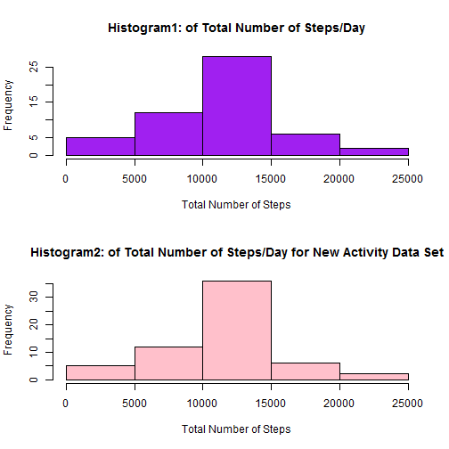
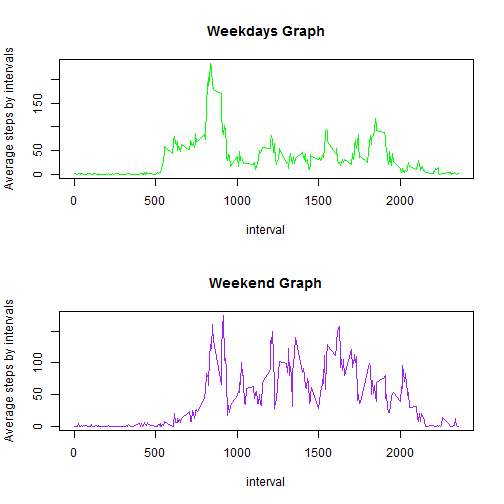

#loading Library

```r
library(dplyr)
library(lattice)
library(knitr)
```
#Loading and preprocessing the data

```r
AC <- read.csv("activity.csv", stringsAsFactors=FALSE)
```

###calculating total number of steps/day

```r
TStep <- aggregate(steps~date, data=AC, FUN=sum, na.rm=TRUE)
```
#What is mean total number of steps taken per day?
### Generating the Histogram by each day
###Mean & Median of total number of steps per day
1.Make a histogram of the total number of steps taken each day
2.Calculate and report the mean and median total number of steps taken per day

```r
hist(TStep$steps,col="pink",xlab="Total Number of Steps", main="Histogram of Total Number of Steps/Day")
##summary(TStep, na.rm=TRUE)
meansteps = mean(TStep$steps)
mediansteps = median(TStep$steps)
abline(v= meansteps, col="red",lty= 1, lwd=5)
abline(v= mediansteps, col="blue",lty=2, lwd = 3)
text("Mean is", mean(TStep$steps), "Median is",median(TStep$steps))
```

```
## Warning in xy.coords(x, y, recycle = TRUE): NAs introduced by coercion
```



```r
##summary(TStep)
```

#What is the average daily activity pattern?
3.Make a time series plot (i.e. type = "l") of the 5-minute interval (x-axis) and the average number of steps taken, averaged across all days (y-axis)

```r
FiveminAvr <- aggregate(steps~interval, data=AC, FUN=mean, na.rm=TRUE)
names(FiveminAvr) = c("interval","AverageSteps")
plot(x = FiveminAvr$interval, y = FiveminAvr$AverageSteps, type = "l",xlab="5 minute intervals", ylab="Average per day", col="purple") 
maxfive <- max(FiveminAvr$AverageSteps)
maxfiveinterval <- FiveminAvr[which.max(FiveminAvr$AverageSteps),]
abline(v= maxfiveinterval[1,1], col="red")
```



###Maximum interval

4.Which 5-minute interval, on average across all the days in the dataset, contains the maximum number of steps?

```r
names(maxfiveinterval) = c("Max interval","AverageSteps")
maxfiveinterval
```

```
##     Max interval AverageSteps
## 104          835     206.1698
```
#Imputing missing values
5.Calculate and report the total number of missing values in the dataset (i.e. the total number of rows with NAs)
6.Devise a strategy for filling in all of the missing values in the dataset. The strategy does not need to be sophisticated. For example, you could use the mean/median for that day, or the mean for that 5-minute interval, etc.

###NAs Values, filling strategy is to use the mean of the 5-minute interval

```r
sum(is.na(AC$steps))
```

```
## [1] 2304
```

```r
ActivityNew <- AC %>% group_by(interval) %>%
        mutate(steps = ifelse(is.na(steps), mean(steps, na.rm=TRUE), steps))
```
7.Create a new dataset that is equal to the original dataset but with the missing data filled in.
8.Make a histogram of the total number of steps taken each day and Calculate and report the mean and median total number of steps taken per day. Do these values differ from the estimates from the first part of the assignment? What is the impact of imputing missing data on the estimates of the total daily number of steps?

```r
TStepNew <- aggregate(steps~date,ActivityNew,FUN=sum)
par(mfrow=c(2,1))
hist(TStep$steps,col="purple",xlab="Total Number of Steps", main="Histogram1: of Total Number of Steps/Day")

hist(TStepNew$steps,col="pink",xlab="Total Number of Steps", main="Histogram2: of Total Number of Steps/Day for New Activity Data Set")
```



```r
summary(TStepNew)
```

```
##      date               steps      
##  Length:61          Min.   :   41  
##  Class :character   1st Qu.: 9819  
##  Mode  :character   Median :10766  
##                     Mean   :10766  
##                     3rd Qu.:12811  
##                     Max.   :21194
```
Answer: Total daily number of steps has been increased by substituting missing value with the 5min-interval mean

#Are there differences in activity patterns between weekdays and weekends?

```r
weekEndData <- function(date) {
    if (weekdays(as.Date(date)) %in% c("Saturday", "Sunday")) {
        "weekend"
    } else {"weekday" }}
AC$WeekendORnot <- as.factor(sapply(AC$date, weekEndData))
```


```r
AC2 <- split(AC, AC$WeekendORnot, drop=FALSE)
AC3 <- aggregate(steps~interval, data=AC2$weekday, FUN=mean, na.rm=TRUE)
AC4 <- aggregate(steps~interval, data=AC2$weekend, FUN=mean, na.rm=TRUE)
par(mfrow= c(2,1))
plot(x= AC3$interval ,y= AC3$steps, col="green",type="l",xlab="interval", ylab="Average steps by intervals", main="Weekdays Graph", )
plot(x= AC4$interval,y= AC4$steps, col="purple",type="l",xlab="interval", ylab="Average steps by intervals", main="Weekend Graph")
```




